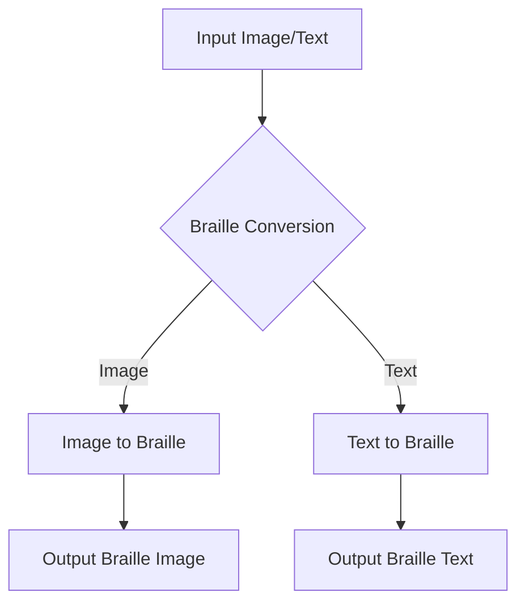

# Braille-Utils Project

This project provides tools for converting between braille and text formats, including image-based braille.

## Project Structure

```
braille-utils/
├── api/
│   ├── index.py
│   ├── serve.py
│   ├── static/
│   │   └── images/
│   │   └── last.pt
│   ├── templates/
│   ├── tests/
│   │   ├── conftest.py
│   │   ├── test_index.py
│   │   └── test_utils.py
│   └── utils/
│       ├── braille_image_to_text.py
│       ├── braille_to_text.py
│       ├── image_to_braille.py
│       └── text_to_braille.py
├── .coveragerc
├── .gitignore
├── coverage.txt
├── Dockerfile
├── requirements.txt
└── uploads/
```

## Website:
<a href="https://braille-utils.onrender.com/"><strong>Our website is live!</strong></a>

Note that, it's hosted on render under a free plan. So, there's a severe limitation of 512 MB RAM, which is just not enough to run `easyOCR` and `YOLO` models. So, the image translation doesn't work on the website. 
## Project Overview

Welcome to `braille-utils`.

This project aims to provide a comprehensive set of tools for converting between braille and text formats, including image-based braille.


# Contribution Workflow

Hello contributors, here is the contribution guideline you should follow:

- **First, create a fork of this repo.** 

- Go to the forked repository and **Clone the fork of your repo to the destination folder**.
```console
$ git clone https://github.com/YOUR_USERNAME/braille-utils.git
```
- Navigate to the Project repository
```console
$ cd braille-utils
```
- Add Upstream to your clone

```console
$ git remote -v
> origin  https://github.com/YOUR_USERNAME/braille-utils.git (fetch)
> origin  https://github.com/YOUR_USERNAME/braille-utils.git (push)
```
```console
$ git remote add upstream https://github.com/Aritra8438/braille-utils.git
```

```console
$ git remote -v
> origin    https://github.com/YOUR_USERNAME/YOUR_FORK.git (fetch)
> origin    https://github.com/YOUR_USERNAME/YOUR_FORK.git (push)
> upstream  https://github.com/Aritra8438/braille-utils.git (fetch)
> upstream  https://github.com/Aritra8438/braille-utils.git (push)
- Before making any changes, sync your origin with upstream 

```console
$ git pull upstream main --rebase
``` 


- Make some changes to the project. After that, open a new branch and commit the changes.

```console
$ git checkout -b <new_branch>
$ git add .
$ git commit -m "Commit message"
$ git push origin <new branch>
``` 

- There will be a visible change in your repo, click on that and create a new pull request.

Don't forget to run tests before creating the pull request.

For testing, you need additional two python packages, install them:
```console
pip install thefuzz
pip install coverage
```

After that you need to run the tests:
```console
coverage run -m pytest -s
coverage report > coverage.txt
```
You should make sure to pass all the tests before pushing to origin.

Thank you for your contribution.

## Local Development Setup

Open the terminal at the destination folder:

```console
# Cloning the repository
git clone https://github.com/Aritra8438/braille-utils.git

cd braille-utils

# Creating a virtual environment
pip install virtualenv

# linux users
virtualenv venv
source venv/bin/activate

# Windows users
python -m virtualenv venv
./venv\Scripts\activate

# Download packages
pip install -r requirements.txt 
```

Your virtual environment should be ready.

To bring up the server on port `5000`:
```console
python .\api\index.py
```

To run in production mode, you can use the `dockerfile`.
```console
docker build -t braille-utils .
docker run -d --name braille-utils-server -p 5000:5000 braille-utils 
```
Note that, this will use the port `10000`.

The image is also available on `Docker Hub` [here](https://hub.docker.com/r/aritra8438/braille-utils).
You can pull the image using:
```console
docker pull aritra8438/braille-utils
```

## Process Diagram



# Current Work
- [x] Support for `Braille-to-text` translation.
- [x] Support for `text-to-braille` translation.
- [x] Support for `text-image` processing and translation.
- [x] Support for `braille-image` processing and translation.

# Future Work
- [ ] Add the support for contractions.
- [ ] Implement more robust error handling.
- [ ] Find a good dataset to further train the `YOLO` model.
- [ ] Consider adding support for different braille formats.
